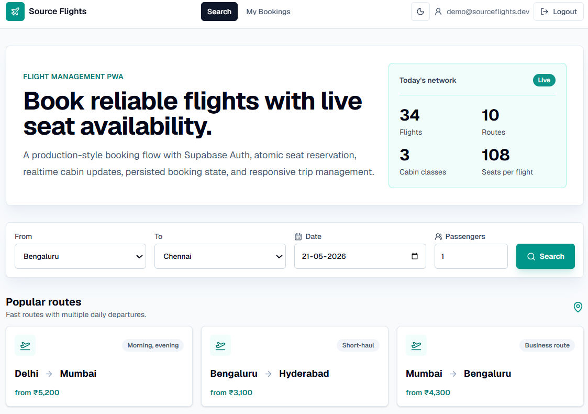
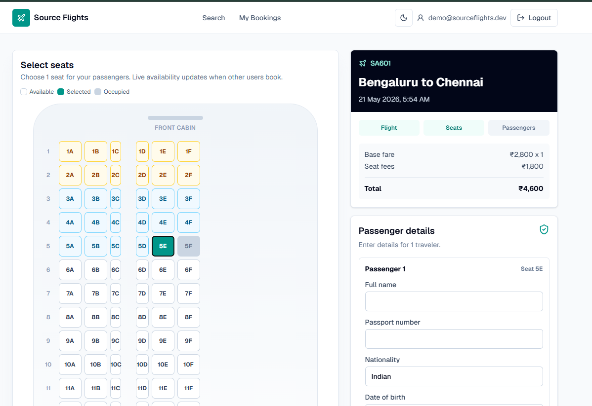
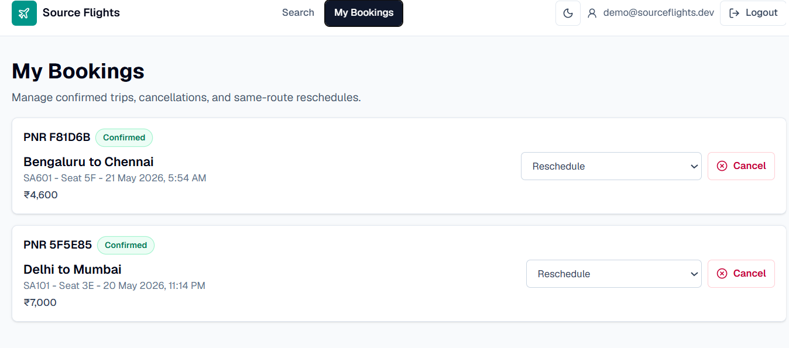
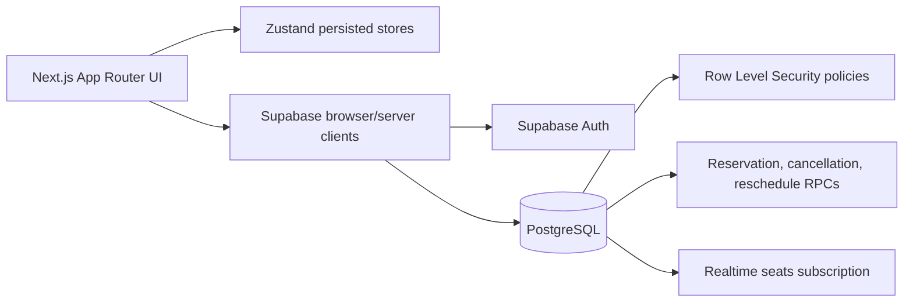

# Source Flights

A responsive Flight Management web app built for the Source Asia frontend internship assignment. The app covers flight search, booking, realtime seat selection, booking cancellation, same-route rescheduling, Supabase Auth, RLS-backed data access, and Zustand persistence.

## Live Demo

Production: https://source-flights.vercel.app/

## Reviewer Test Flow

1. Open the live demo.
2. Log in with the demo account.
3. Search `Bengaluru -> Chennai` with `2` or more passengers.
4. Select a flight.
5. Select the same number of seats as passengers.
6. Fill passenger details for every traveler.
7. Confirm the booking.
8. Open My Bookings.
9. Cancel or reschedule a booking.

## Screenshots

### Search and routes



### Seat selection



### My Bookings



## Tech Stack

- Next.js 16 App Router with TypeScript
- Tailwind CSS
- Supabase PostgreSQL, Auth, Realtime, RLS, and RPC functions
- Zustand with `persist` and `partialize`
- Vercel-ready deployment

## Features

- Search flights by origin, destination, date, and passenger count
- View flight results with fare, duration, aircraft, and status
- Select seats from a visual aircraft cabin map
- Realtime seat availability updates through Supabase Realtime
- Atomic seat reservation through a Supabase RPC
- Passenger details forms and booking confirmation with PNR
- My Bookings page with status badges
- Atomic cancellation that frees the seat
- DB-level rejection for cancellations within 2 hours of departure
- Same-route rescheduling with fare difference calculation
- Zustand persisted booking state with sensitive passport data excluded
- Basic PWA manifest and offline fallback route

## Local Setup

```bash
npm install
cp .env.example .env.local
npm run dev
```

Open `http://localhost:3000`.

## Environment Variables

```bash
NEXT_PUBLIC_SUPABASE_URL=
NEXT_PUBLIC_SUPABASE_ANON_KEY=
```

Only the Supabase anon key is used in the browser. Database writes that need consistency are handled by Supabase RPC functions and protected by RLS/auth checks.

## Supabase Setup

Create a Supabase project, enable email/password auth, and run the SQL files in this order:

```txt
supabase/migrations/001_initial_schema.sql
supabase/migrations/002_rls_policies.sql
supabase/migrations/003_rpc_functions.sql
supabase/migrations/004_seed_data.sql
supabase/migrations/005_expand_flight_seed_data.sql
supabase/migrations/006_remove_public_seat_holder.sql
supabase/migrations/007_refresh_seat_rpcs_without_holder.sql
```

Enable Realtime for the `seats` table from Supabase SQL Editor:

```sql
alter publication supabase_realtime add table public.seats;
```

If Supabase says the table is already added to the publication, no further action is needed.

Recommended test account:

```txt
Email: demo@sourceflights.dev
Password: SourceAsia@123
```

If the account does not exist yet, use the Sign up mode on `/login` with the same credentials.

## Database Design

The schema includes:

- `flights`: searchable schedule and pricing data
- `seats`: per-flight seat map, class, availability, and extra fee
- `bookings`: user-owned booking records with PNR and status
- `passengers`: passenger details linked to a booking
- `reschedules`: audit trail for flight changes and charged fee

RLS is enabled on all tables. Public schedule data is readable, while bookings, passengers, and reschedules are scoped to `auth.uid()`.

## RPC Functions

`reserve_seat` validates auth, locks the requested seat row, checks availability, marks the seat unavailable, inserts the booking, inserts passenger data, and returns the booking ID and PNR.

`cancel_booking` validates ownership, updates the booking status, and frees the seat in one database transaction.

`reschedule_booking` validates same-route changes, picks the requested new seat, frees the old seat, updates the booking, and records the fee difference.

A database trigger rejects cancellation updates when departure is within 2 hours.

## Zustand Architecture

`useFlightStore` keeps the active search query, selected flight, selected seats, booking step, and passenger drafts. The store persists the search and in-progress booking state, but `partialize` intentionally clears `passportNo` before writing to localStorage.

`useUserStore` keeps the Supabase session and cached bookings. Only session fields required to resume auth state are persisted. Cached bookings support a readable My Bookings experience after reloads and as a basis for offline fallback behavior.

Both stores expose reset actions used after logout and booking cancellation.

## Architecture



## Production Decisions

- Seat booking runs through a PostgreSQL RPC so availability is checked and updated atomically.
- Cancellation is also handled through an RPC so the booking status and seat availability stay consistent.
- The 2-hour cancellation rule is enforced by a database trigger instead of client-only validation.
- Passport numbers are intentionally excluded from Zustand persistence with `partialize`.
- Multi-passenger checkout creates one booking and PNR per traveler, which makes cancellation and rescheduling manageable per passenger.
- Public seat reads do not expose user identifiers; seat availability is enough for the cabin UI.

## Trade-offs

- Multi-passenger checkout creates one booking record per passenger and selected seat, so each traveler has an individual PNR and can be managed separately.
- Payment processing is intentionally out of scope.
- The PWA implementation includes a manifest and offline page. A full `next-pwa` cache strategy and Lighthouse screenshot can be added as a bonus polish step after core flows are verified.
- The reschedule UI automatically assigns the first available seat on the selected same-route flight to keep the flow fast within the assignment timeline.

## Scripts

```bash
npm run dev
npm run lint
npm run build
```

## Deployment

Deploy on Vercel and add the same environment variables from `.env.example`. After deployment, create/sign in with the test account and verify:

1. Search a seeded route.
2. Select a flight and seat.
3. Confirm a booking.
4. Open My Bookings.
5. Cancel or reschedule the booking.

## Manual QA Checklist

- Search works for seeded routes and empty states appear for unavailable routes.
- Multi-passenger checkout requires the same number of selected seats as passengers.
- Seat selection is scrollable and touch-friendly on mobile.
- Booked seats become unavailable after confirmation.
- Realtime seat updates work after `public.seats` is added to `supabase_realtime`.
- My Bookings shows confirmed, cancelled, and rescheduled statuses.
- Cancellation frees the seat and is blocked within 2 hours of departure by the database trigger.
- Logout resets persisted booking state.
- Dark mode keeps text and controls readable.
